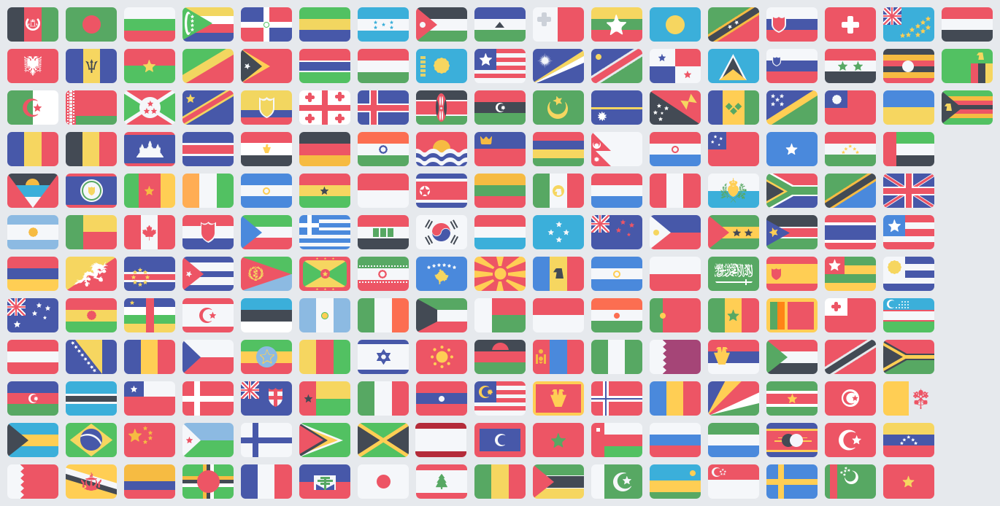

# Teamspeak 3 Country Flag Converter



This mini app renames all country flags from the input direcotry to the associated country code.
  
For example: 'Switzerland.png' to 'ch.png'  
  
Additionally, it resizes the image to a max width of 16px which teamspeak expects.

The beautiful flat flags are designed by [Muharrem Şenyıl](https://dribbble.com/shots/1211759-Free-195-Flat-Flags).

## Getting Started

**You don't need to run the converter yourself!** If you like these icons. Just download the converted images from the [output directory](https://github.com/strebl/teamspeak3-country-flags/tree/master/output).

To use the icons in your Teamspeak 3 Client, put these icons into the countries.zip in the gfx direcotry.

Location: `\path\to\Teamspeak 3 Client\gfx\countries.zip`

*Replace `\path\to\Teamspeak 3 Client` with your actual Teamspeak 3 Client installation path.**

## Installation

You need **PHP**, **Composer** and **git** to use this!

Run following commands:
```
git clone https://github.com/strebl/teamspeak3-country-flags.git
cd teamspeak3-country-flags
composer update
```

## Usage

Run following command:
```
php index.php
```

To use the icons in your Teamspeak 3 Client, put these icons into the countries.zip in the gfx direcotry.

Location: `\path\to\Teamspeak 3 Client\gfx\countries.zip`

*Replace `\path\to\Teamspeak 3 Client` with your actual Teamspeak 3 Client installation path.**

## Preview


### Questions / Problems?

Just create an issue!

### Fragen / Probleme?

Erstelle einfach ein "Issue"!